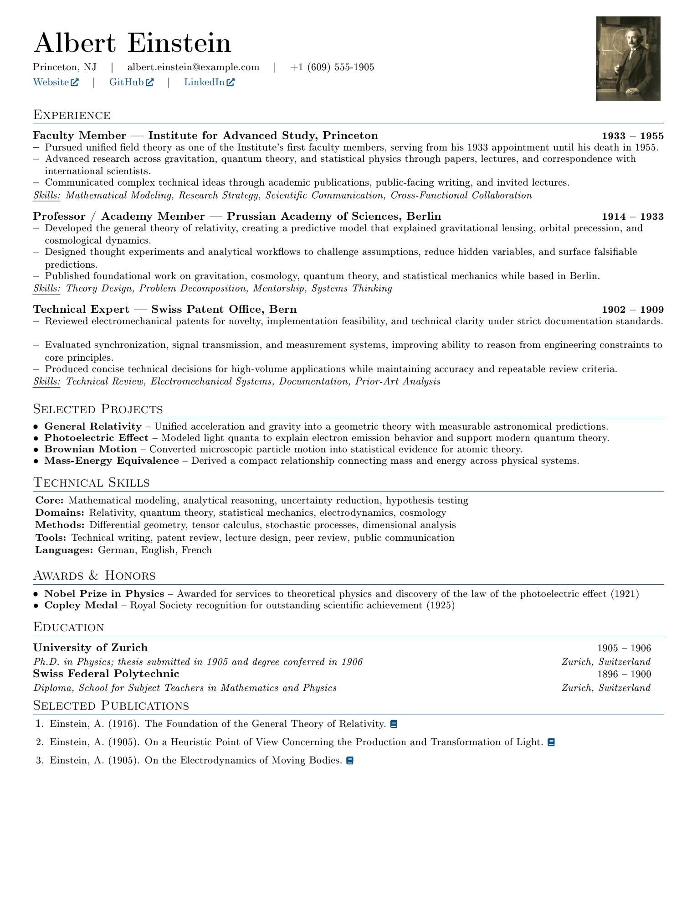

# Industry Resume Template

A compact one-page LaTeX resume template for industry applications. The included example uses Albert Einstein as a public sample profile, so the repository contains no private candidate information. Publication entries include clickable book icons for source links.



## Files

- `resume.tex` - editable LaTeX source
- `resume.pdf` - compiled one-page PDF
- `assets/resume.png` - preview image used in this README
- `assets/einstein.jpg` - sample portrait, public-domain image from Wikimedia Commons

## Build

```bash
pdflatex -interaction=nonstopmode resume.tex
```

## Image Credit

The sample portrait is Albert Einstein in 1921 by Ferdinand Schmutzer, sourced from Wikimedia Commons and marked public domain. Sample facts were cross-checked against NobelPrize.org for the 1921 Physics Prize, the Institute for Advanced Study for the 1933-1955 appointment, the Swiss Federal Institute of Intellectual Property for the 1902-1909 patent-office role, the University of Zurich for the 1905 dissertation / 1906 doctorate, ETH Zurich Library for the 1896-1900 Polytechnic studies, Wiley DOI records for the Annalen der Physik papers, and Inspire HEP for the special relativity paper.

## License

MIT
